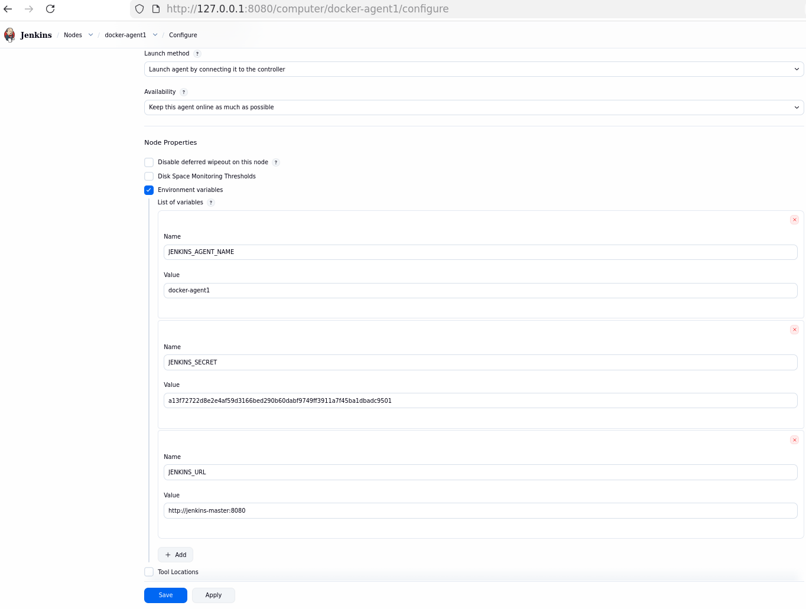

# Jenkins Setup

## Manual setup

```sh
docker pull alpine:3.23
docker network create jenkins
docker run --rm -it --name my-alpine --network jenkins -p 9090:9090 alpine:3.23 sh

# docker exec -it --user root db9a4c4d530a sh

apk update

apk search -v openjdk

# coreutils to run sha256sum
# fontconfig ttf-dejavu fonts needed for jenkins

apk add --no-cache coreutils curl fontconfig ttf-dejavu git openjdk21-jre

# apk del openjdk21-jre-headless

adduser -D myuser
su myuser
cd "/home/myuser"

mkdir -p "/home/myuser/jenkins_home"
export JENKINS_HOME="/home/myuser/jenkins_home"

# -f - fail on request error
# -L follow redirect
# -O save as file
curl -fLO https://get.jenkins.io/war-stable/2.541.1/jenkins.war

# hash check
# see https://get.jenkins.io/war-stable/2.541.1/jenkins.war.sha256
EXPECTED="8b12678aa6f9550b06825b006f9096186b17a7b857e9b68ad3f980d9f430fc94"
ACTUAL=$(sha256sum jenkins.war | awk '{print $1}')

if [ "$ACTUAL" = "$EXPECTED" ]; then
  echo "Checksum OK"
else
  echo "Checksum FAILED"
  exit 1
fi
# hash check

java -jar jenkins.war --httpPort=9090
```

## Progress

- With recommended plugins
- 

### Echo example

- 
- Enable: Delete workspace before build starts
- Build: execute shell `echo "Build ID: ${BUILD_ID}"`
- Save
- Build now
- Open successfully build in history
- Open console output

### Docker node

- add docker plugin
- 
- manage -> configure clouds

```sh
docker pull alpine/socat:1.8.0.0

# --network jenkins
docker run -d --restart=always \
    --name my-alpine-socat \
    -p 127.0.0.1:2376:2375 \
    --network jenkins \
    -v /var/run/docker.sock:/var/run/docker.sock \
    alpine/socat:1.8.0.0 tcp-listen:2375,fork,reuseaddr \
    unix-connect:/var/run/docker.sock
```

## References

1. [Jenkins War Packages (to download war archives)](https://get.jenkins.io/war-stable/)
1. [What Are The Steps To Install Jenkins On Linux Using A War File?](https://manage.accuwebhosting.com/knowledgebase/5378/What-Are-The-Steps-To-Install-Jenkins-On-Linux-Using-A-War-File.html)
1. <https://github.com/devopsjourney1/jenkins-101>
